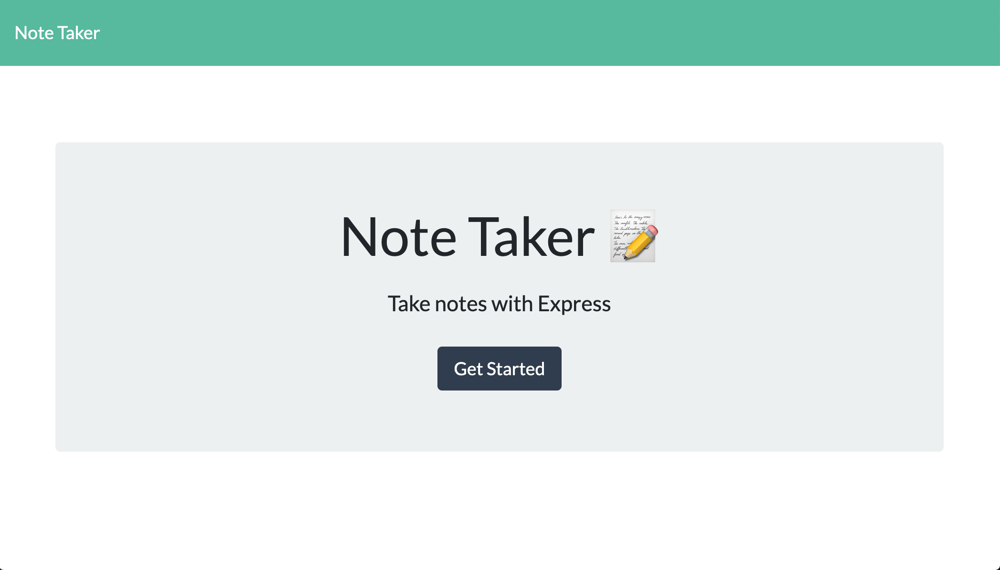
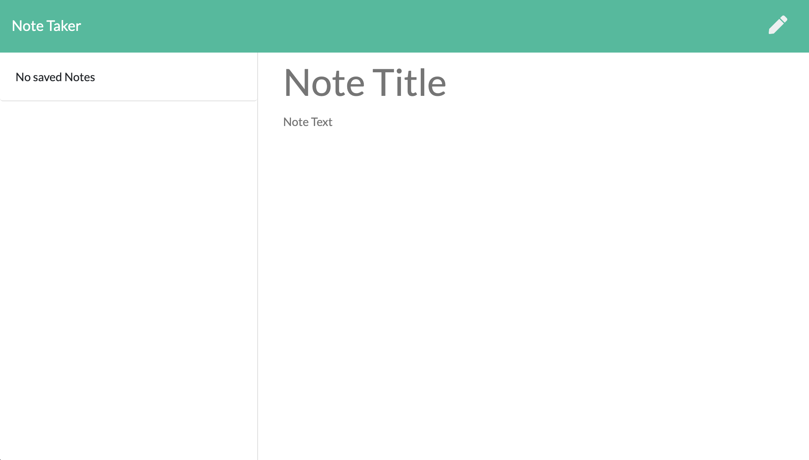
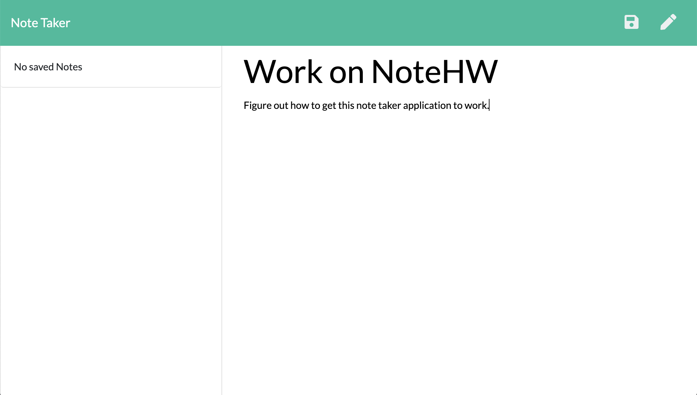
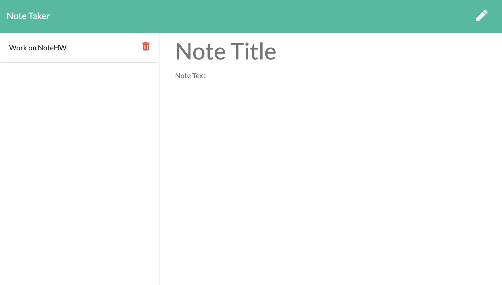
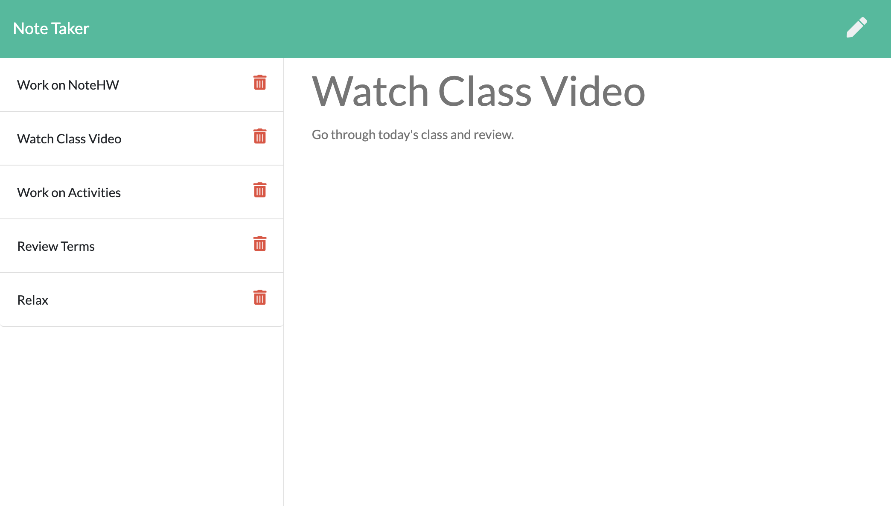
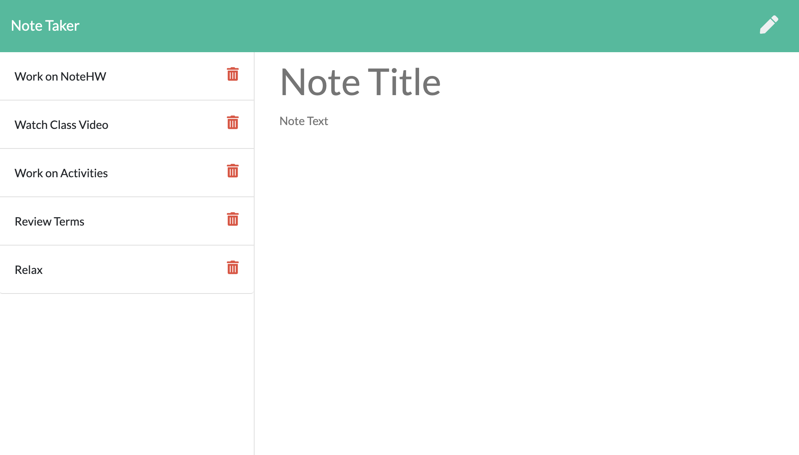
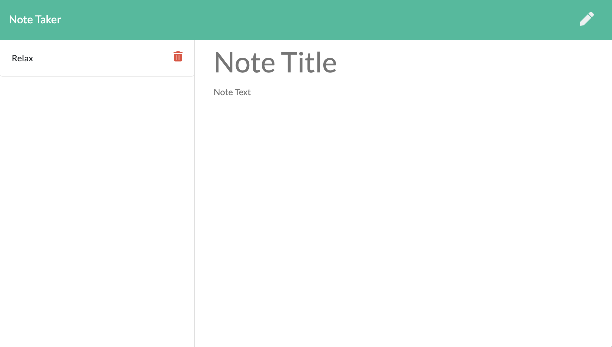

# Note-Taker332

## Description

This application can be used to write, save, and delete notes using an express backend while saving and retrieving note data from a JSON file. The front end was provided by GA Tech Bootcamp and I was tasked with creating the back end.

## Table of Contents

* [Installation](#installation)
* [Usage](#usage)
* [License](#license)
* [Contributing](#Contributing)
* [Tests](#tests)
* [Questions](#questions)

## Installation

All you need to do is click this link: https://notetaker-calvin-griffin.herokuapp.com/

## Usage

When the application opens, you are taken to the title page. 

Once the user clicks the "Get Started" button, they are navigated to the notes page where they can write their notes. 

Once the note is written, click the save button and the note will appear in a list on the left side of the screen.  

At any time, the user can click on a note in the list on the left, and that note will appear on the page again. 

If the user would like to then write another note, they can click the write icon. 

Once the user wishes to delete a note, they click the delete icon next to the corresponding note.

## License

This project is covered under the MIT License.  
Copyright (c) [2020] [Calvin Griffin]  
Permission is hereby granted, free of charge, to any person obtaining a copy of this software and associated documentation files (the "Software"), to deal in the Software without restriction, including without limitation the rights to use, copy, modify, merge, publish, distribute, sublicense, and/or sell copies of the Software, and to permit persons to whom the Software is furnished to do so, subject to the following conditions:
The above copyright notice and this permission notice shall be included in all copies or substantial portions of the Software.
THE SOFTWARE IS PROVIDED "AS IS", WITHOUT WARRANTY OF ANY KIND, EXPRESS OR IMPLIED, INCLUDING BUT NOT LIMITED TO THE WARRANTIES OF MERCHANTABILITY, FITNESS FOR A PARTICULAR PURPOSE AND NONINFRINGEMENT. IN NO EVENT SHALL THE AUTHORS OR COPYRIGHT HOLDERS BE LIABLE FOR ANY CLAIM, DAMAGES OR OTHER LIABILITY, WHETHER IN AN ACTION OF CONTRACT, TORT OR OTHERWISE, ARISING FROM, OUT OF OR IN CONNECTION WITH THE SOFTWARE OR THE USE OR OTHER DEALINGS IN THE SOFTWARE.

## Contributing

If you would like to contribute, please contact me via email or GitHub.

## Tests

Click the link and give it a shot.

## Questions

If you have any additional questions, please contact me via email or GitHub by clicking the links below.

Email: cgriffin332@gmail.com  
GitHub: https://github.com/cgriffin332
